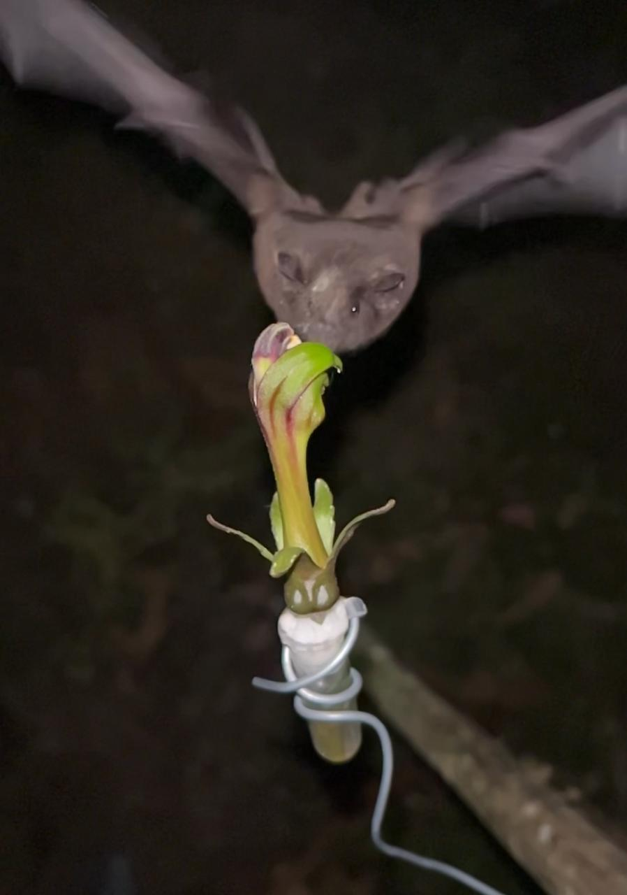
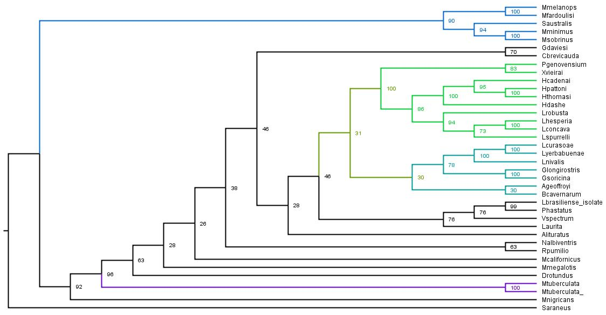

# **Adaptaciones Sensoriales de los Murciélagos Nectarívoros: un estudio de vibrisas** 

## Andrea Caicedo L. (acaicedo856@puce.edu.ec)
## Junio 25,2024

### El orden Chiroptera destaca entre los mamíferos por la evolución de características únicas como el vuelo y la ecolocación. Algunos de sus taxones están especializados en diferentes recursos alimenticios (insectos, pequeños vertebrados, frutas, sangre o néctar) que se asocian a rasgos morfológicos específicos. Un claro ejemplo de estas adaptaciones se observa en los murciélagos que se alimentan de néctar, que han adoptado diversas especializaciones morfológicas, fisiológicas y conductuales que facilitan su interacción con las flores (Figura 1). 

### : 

### **Figura 1.** *Anoura caudifer* que se aproxima a un recurso importante en su alimentación (*Burmeistera sp.*)

### Entre las características morfológicas relacionadas con la nectarívoria están  lenguas alargadas y retráctiles, hocicos alargados, dentición parcialmente reducida y cráneos especializados. Otra característica recientemente evidenciada son las vibrisas, que poseen un crecimiento similar a un cepillo que apunta hacia adelante alrededor del hocico y que son más largas en comparación con otras especies de diferentes gremios. Las vibrisas de murciélagos nectarívoros, al ser orgános sensoriales, influyen en aspectos importantes de su alimentación como la duración de visitas, cantidad de néctar consumido, la posición relativa de la flor y la estabilidad del vuelo sostenido.

### **Figura 2.** *Anoura caudifer* con polen en la cabeza despues de alimentarse de *Burmeistera nigripilosa*

### El orden Chiroptera contiene 18 familias de las cuales tres contienen especies morfológicamente adaptadas para alimentarse de néctar. Las familias representantes son Phyllostomidae en el Nuevo Mundo con las subfamilias Glosshophaginae y Lonchophyllinae, Pteropodidae en el Viejo Mundo con la subfamilia Macroglossinae, y Mystacinidae en Nueva Zelanda con un solo género (Mystacina). 

### El objetivo del proyecto es recopilar especies de murciélagos nectarívoros tanto del Viejo como del Nuevo Mundo para realizar una filogenia. Esto permitirá analizar si es posible identificar un ancestro común a partir del cual evolucionaron las características del tamaño y la orientación de las vibrisas para explotar el nicho disponible.  

## **Instrucciones**

### Para la ejecuciòn del proyecto final de la clase de Bioinformatica se analizaron las secuencias del gen citocromo b (cytb) de 23 especies nectarívoras, cinco de la subfamilia Macroglossinae, diez de la subfamilia Lonchophyllinae, siete de Glossophaginae, y la especie Mystacina tuberculata. Además, se incluyeron las secuencias de 12 especies de la familia Phyllostomidae asociados a otros recursos alimenticios (frutos, peces, sangre, omnívoros) y una especie de la familia insectívora Vespertilionidae. Como especie externa se tomó a Sorex araneus (Soricidae).
### Se presentan cuatro carpetas (Data, Script, Filogenia, Imagenes) con datos, scripts y resultados de la filogenia realizada.

### **Programas:**

### 1) Gitbash
### 2) Iqtree
### 3) Figtree

### **Carpeta 1: Data**

### Esta carpeta contiene las secuencias del gen citocromo b de las especies mencionadas anteriormente y su archivo fasta de genes alineados.  La alineación fue reaizada en GitBash con el programa Muscle5.1.win64.

### El comando utilizado para alinear las secuencias fue:

### ./muscle5.1.win64.exe -align Bats_secuences.txt -output musscle_NectarBats.aln.fasta

### **Carpeta 2: Scripts**

### Esta carpeta contiene el script de los comandos utilizados en Gitbash y los archivos para construir un árbol filogenético a partir de las secuencias alineadas en musscle_NectarBats.aln.fasta. 

### **Carpeta 3: Filogenia**

### Esta carpeta contiene los archivos generados por "Muscle". El análisis usa bootstrap con 1000 réplicas para evaluar la robustez del árbol. En el proceso se generó un archivo .treefile para visualización de la filogenia en FigTree.

### **Figura 3.** Filogenia de murciélagos nectarívoros del mundo con base en el gen nuclear citocromo b. 

